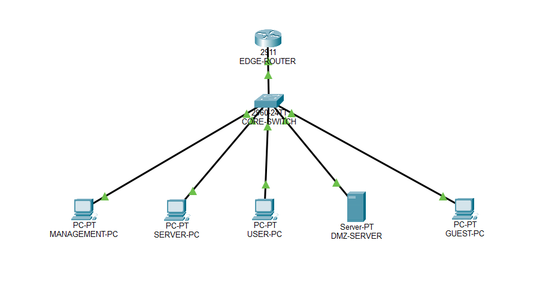

# Enterprise Network Security & Segmentation Lab

A network segmentation and access control lab implemented using Cisco Packet Tracer.

## Overview

This project demonstrates a segmented enterprise network designed to separate different types of devices and control communication between network segments.

The network is divided into five VLANs: Management, Servers, Users, DMZ, and Guest. Inter-VLAN communication is provided using router-on-a-stick, while DHCP and extended ACLs are used for network configuration and access control.

## Network Topology

The topology consists of:

- Cisco 2911 router
- Core switch
- Management PC
- Server PC
- User PC
- DMZ web server
- Guest PC

## VLANs

| VLAN | Name | Network | Gateway |
|------|------|---------|---------|
| 10 | MANAGEMENT | 192.168.10.0/24 | 192.168.10.1 |
| 20 | SERVERS | 192.168.20.0/24 | 192.168.20.1 |
| 30 | USERS | 192.168.30.0/24 | 192.168.30.1 |
| 40 | DMZ | 192.168.40.0/24 | 192.168.40.1 |
| 50 | GUEST | 192.168.50.0/24 | 192.168.50.1 |

## Implemented Features

- VLAN creation and network segmentation
- Access and trunk port configuration
- 802.1Q router-on-a-stick inter-VLAN routing
- IPv4 addressing
- DHCP configuration
- Extended ACL configuration
- Guest network isolation
- DMZ web server
- HTTP and HTTPS services
- Access control between network segments

## Security Policies

The network uses extended ACLs to control traffic between VLANs.

- **Management VLAN:** Allowed to access other network segments as required.
- **Server VLAN:** Provides access to required network resources.
- **User VLAN:** Allowed to access the Server VLAN and the DMZ web server through HTTP and HTTPS.
- **Guest VLAN:** Isolated from Management, Servers, Users, and DMZ networks.
- **DMZ:** Contains the web server and provides a separate network segment for web services.

## Access Control Testing

The configured ACL rules were tested in Cisco Packet Tracer.

| Source | Destination | Result |
|--------|-------------|--------|
| User | DMZ HTTP | Allowed |
| User | DMZ HTTPS | Allowed |
| Guest | Management | Blocked |
| Guest | Servers | Blocked |
| Guest | Users | Blocked |
| Guest | DMZ | Blocked |
| Guest | Guest Gateway | Allowed |

## Technologies

- Cisco Packet Tracer
- Cisco IOS
- VLAN
- 802.1Q
- Router-on-a-Stick
- DHCP
- Extended ACL
- IPv4
- HTTP / HTTPS

## Project Files

- `network-security-lab.zip` — ZIP archive containing the Cisco Packet Tracer `.pkt` project file.
- `topology.png` — Network topology screenshot.

## Project Status

Completed as a Cisco Packet Tracer network segmentation and access control lab.
